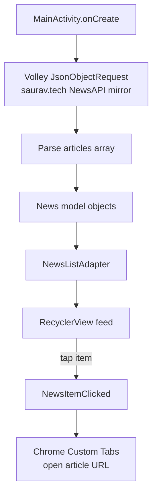

# News_App

Simple Android news reader — fetches a fixed JSON feed and lists articles in a RecyclerView, opening the full story in an in-app Chrome tab.

## How it works

`MainActivity` issues a Volley `JsonObjectRequest` to a static news-mirror JSON endpoint (`saurav.tech/NewsAPI/everything/cnn.json`), parses the `articles` array into `News` model objects, and binds them to a `RecyclerView` via `NewsListAdapter`. Tapping an item (`NewsItemClicked` callback) opens that article's URL using Android's Chrome Custom Tabs instead of a full browser switch.

## Architecture

| File | Role |
|---|---|
| `MainActivity.kt` | Fetches news JSON, binds RecyclerView, handles article taps |
| `News.kt` | Article model (title, author, url, image) |
| `NewsListAdapter.kt` | RecyclerView adapter for the article list |
| `MySingleton.kt` | Shared Volley request-queue singleton |

## Tech stack

Kotlin · Android RecyclerView · Volley · Chrome Custom Tabs

## Setup

Open in Android Studio and run on an emulator/device.
